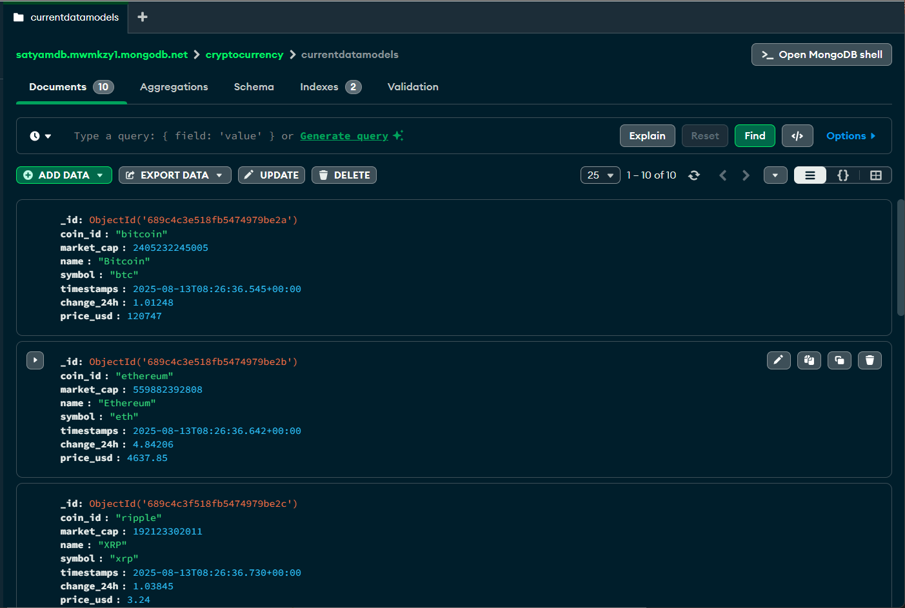
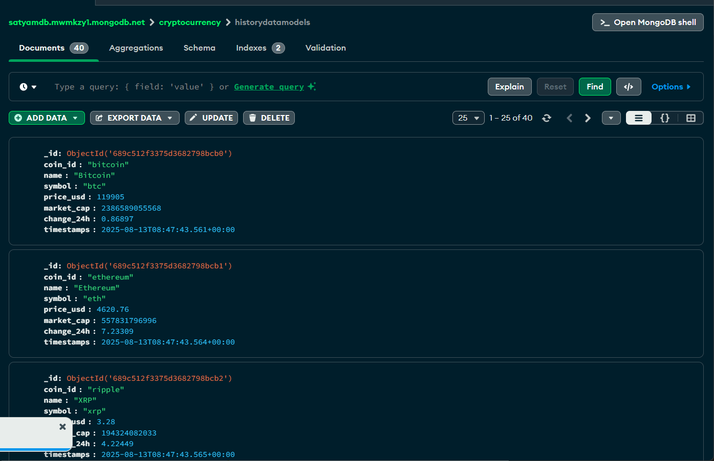
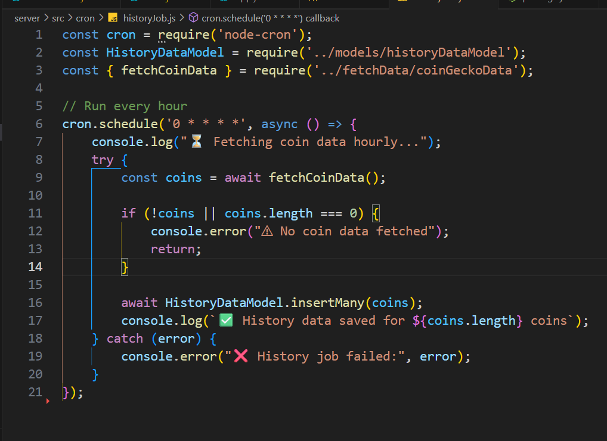

# 🚀 Cryptocurrency Tracker

A full-stack **MERN** application to track live cryptocurrency prices using the **CoinGecko API**, styled with **Tailwind CSS**.  
The app displays real-time crypto data, allows searching/filtering, and has both **frontend** (React) and **backend** (Node.js + Express) parts.

---

## Live Frontend Link
```bash
https://cryptocurrency-tracker-fe35.vercel.app
```

## Live Backend Link
```bash

```

## 📌 Tech Stack

### Frontend (Client):
- React.js (Vite)
- Tailwind CSS

### Backend (Server):
- Node.js
- Express.js
- Axios / Fetch (to get CoinGecko data)
- CORS enabled

### Database:
- MongoDB (via Mongoose)

### Deployment:
- Frontend → Vercel / Netlify
- Backend → Render

---

## 🗂 Folder Structure
```txt
cryptocurrency-tracker/
│
├── client/ # React + Tailwind frontend
│ ├── src/
│ │ ├── components/
│ │ ├── pages/
│ │ ├── App.jsx
│ │ └── main.jsx
│ ├── package.json
│ └── tailwind.config.js
│
└── server/ # Node.js + Express backend
├── src/
│ ├── app.js 
│ │
│ ├── config/ # Configuration
│ │ └── db.js # MongoDB connection
│ │
│ ├── models/ # Mongoose models
│ │
│ ├── routes/ # Express routes
│ │
│ ├── fetchData/ # External API fetching (coinGecko Fetch crypto data)
│ │
│ ├── cron/ # Scheduled jobs
│
├── package.json
└── .env
```

---

## ⚙️ Installation & Setup

### 1️⃣ Clone the repository
```bash
git clone https://github.com/<your-username>/cryptocurrency-tracker.git
cd cryptocurrency-tracker
```
## Backend (Server) Setup
```bash
cd server
npm install
```
### .env
```bash
 DB_CONNECTION_URL=
```
### Run backend in development:
```bash
npm run dev
```

## Frontend (Client) Setup

```bash
cd client
npm install
```
### .env 
```bash
VITE_CoinGecko_API_Key=
VITE_Backend_URL
```
### Run frontend in development:
```bash
npm run dev
```

## ⏳ Cron Job for Hourly Coin Data
### This project uses the node-cron package to automatically fetch and store cryptocurrency data every hour.
#### The cron job works as follows:

- Runs at the start of every hour (0 * * * *).

- Calls fetchCoinData() to retrieve live coin data from the CoinGecko API.

- Saves the fetched data into the HistoryDataModel collection for historical tracking.

- Logs success or error messages to the console for debugging.

- This ensures the database always contains up-to-date historical data without manual intervention.


## DB Image



## Cron Image



